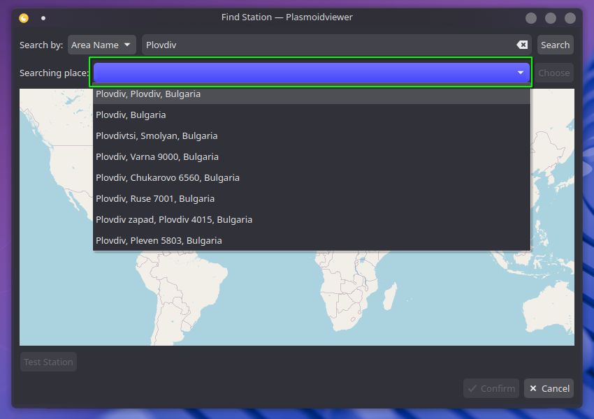

# Wunderground PWS Widget for KDE 6

A Plasma 6 widget for showing weather from Wunderground Personal Weather Stations (PWS).

PWS is a network of [250,000+](https://www.wunderground.com/pws/overview) weather stations that offer local and timely weather conditions. Rather than traditional sources which average data across areas, you can know exactly what the conditions are within a small (many times less than 1km) radius. Furthermore, the stations offer more timely (every 5 minutes) reporting than most sources. This widget includes those local conditions as well as forecasts, alerts, air quality, and additional info for your area.

## Installing

Install at the [KDE Store](https://store.kde.org/p/2135799) or your distribution's package manager if it carries plasma widgets (ie. [Discover](https://apps.kde.org/discover/)[^1]).

## Configuring

This widget relies on local stations (ie. [KGADACUL1](https://www.wunderground.com/dashboard/pws/KGADACUL1)). You can get an overview of stations in your area at [`wunderground.com/wundermap`](https://wunderground.com/wundermap). Do not worry if you don't know any or you cannot access that site! The widget allows you to search by your area name or coordinates.

Once installed, click `Configure Wunderground` or right-click and hit the slider icon. Then, under `Station`, click `Select from Map`.

### Search by city/area

To search by your address, city, locality, or neighborhood, enter that name into the first search box next to the `Search` button. Then, click `Search`. Next, choose the full name of your area with the dropdown box next to the `Choose` button. Click `Choose`. Select a station from the map and hit `✓Confirm`. Due to API restrictions, this must be split into two parts.

  
See steps

  #### Step 1

  Type the area name into the red search bar and click `Search`.

  

  #### Step 2

  That search has populated the green dropdown box with matches for that area name. Select the correct one and the click `Choose`.

  

  #### Step 3

  

  Select any station icon to choose that station. To ensure reliability, hit `Test Station` to see the health of the selected station.

### Search by station ID

If you know your/a station's ID. Choose `Weatherstation ID:` in the `Search by:` dropdown box. Enter the station's ID and hit `Search`.

### Search by coordinates

To search by coordinates, choose `Lat/Lon` in the `Search by:` dropdown box. Drag the compass marker to a place on the map 

### Removing Stations

In the list under the `Station` config page, select the `X` icon to remove that station from the list of saved stations.

### Advanced Manual Add

If you know the station ID and do not want to click through extra steps, hit `+ Manual Add`, enter the case-sensitive station ID, and confirm. The station will be on the list and you should be good to go!

### Find Station (Legacy)

The non-map version of searching for a station is available under `Find Station`.

### Units

Units and time format are fully customizable.

## Translating

Translations are welcome!

Follow the file in [plasmoid/translate](./plasmoid/translate) for directions or feel free to contact me!

## Meta

The weather icons are a mix of [Alessio Atzeni's](https://demo.alessioatzeni.com/) freely licensed [`meteocons`](https://demo.alessioatzeni.com/meteocons/) and [Erik Flowers'](https://github.com/erikflowers/) SIL OFL 1.1 licensed [`weather-icons`](https://erikflowers.github.io/weather-icons/).

Files and portions of files are from [Zren](https://github.com/zren/), [Martin Kotelnik](https://github.com/kotelnik), @Gojir4 on the QML forum, and an upstream version of this widget [rliwoch's](https://github.com/rliwoch) [`plasmoid-wunderground-extended`](https://github.com/rliwoch/plasmoid-wunderground-extended).

Language contributions thanks to [AleksZZ](https://github.com/AleksZZ), [Clover Git](https://github.com/CloverGit), [ekkia](https://github.com/ekkia), [foXaCe](https://github.com/foXaCe), [Heimen Stoffels](https://github.com/Vistaus), [Ivan Todorov](https://github.com/GlobeDotters), [jpmadeira](https://github.com/jpmadeira), Martin Eilsøe, [Pushpal Sidhu](https://github.com/psidhu), [RygorrMortis](https://github.com/RygorrMortis), [tabascosw](https://github.com/tabascosw), undernature, [victorhck](https://github.com/victorhck), and [Yuta Takahashi](https://github.com/Walkmana-25).

If you are not attributed for work in this repository, let me know!

### Known Problems

Qt 6.10: Widget version 3.5.3 and above is required.

Text coloring for dark/transparent themes is currently buggy in Plasma 6. The first time a widget loads the text may not be colored correctly.

Changing the transparency then back again seems to solve this issue. See [#58](https://github.com/k-donn/plasmoid-wunderground/issues/58).
Under Appearance in the widget settings, toggle "Show Background."

The legacy forecast API is geolocation locked in some cases. The newer API is not, but it does not provide all of the same attributes. Checking `Use Legacy Forecast API:` under `Debug` in settings reverts the widget to use the legacy API. Then, you then get the snow, thunder, and golf forecast.

If you are getting lots of `Setting initial properties failed: <COMPONENT> does not have a property called cfg_XXXX` that is a known [Plasma bug](https://bugs.kde.org/show_bug.cgi?id=494417) and does not affect the widget.

## TODO

- i18n
  -   [ ] Translations for new text
- Customizability
  -   [ ] Enum-ify main.xml
  -   [ ] Let user add labels to locations and improve adding flow
  -   [x] Fix wind barb render error
  -   [x] Remove bg in system tray temp view
  -   [x] Remove empty space when downsizing font in compact rep
  -   [x] Widget size/padding/scaling
- Backend
  -   [ ] Better handle null fields
  -   [x] Improve searching and testing error messages
- Parking lot
  -   [ ] Use Wunderground Plasma Ion.
  -   [x] Search by map feature

[^1]: Discover sometimes has difficulties getting the most recent version.
